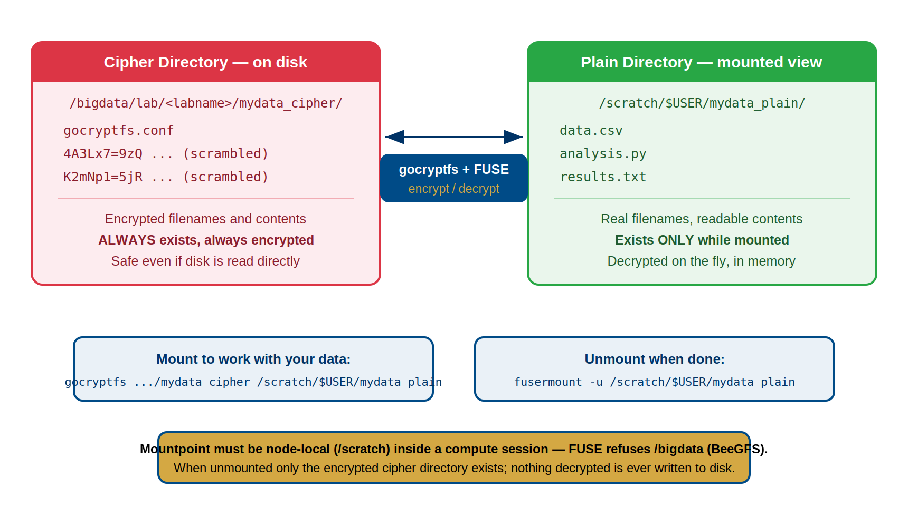
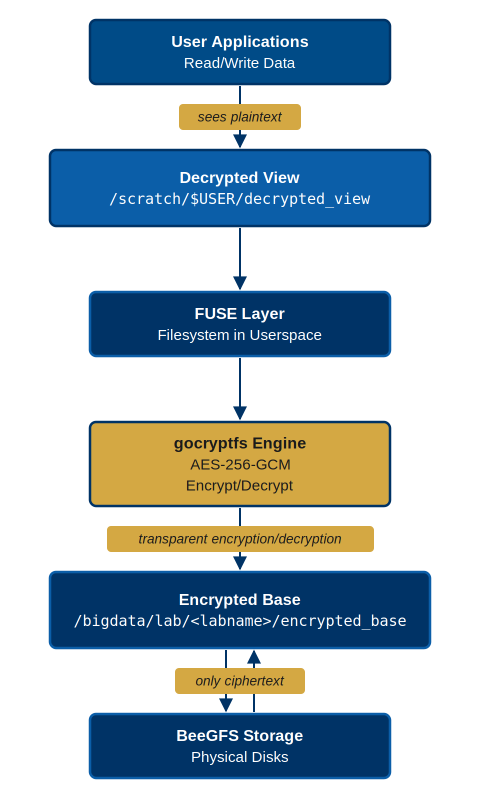

:::::::::::::::::::::::::::::::::::::: questions
- How does gocryptfs work technically?
- What is the two-directory model?
- How does FUSE enable transparent encryption?
- Why is gocryptfs better than alternatives like EncFS?
::::::::::::::::::::::::::::::::::::::::::::::::

::::::::::::::::::::::::::::::::::::: objectives
- Understand gocryptfs architecture and the two-directory model
- Learn what FUSE is and how it enables transparent encryption
- Understand the read/write flow through FUSE and gocryptfs
- Know why gocryptfs is the optimal choice for HPC clusters
::::::::::::::::::::::::::::::::::::::::::::::::

## Introduction: From Theory to Practice

Episode 1 explained **why** encryption matters: regulatory requirements, legal liability, and protecting research subjects. Now you'll understand **how** gocryptfs makes encryption practical for daily research work.

gocryptfs is elegant technology because it makes encryption transparent. When properly set up, you don't think about encryption—you just use your files normally. The magic lies in how gocryptfs achieves this transparency while maintaining military-grade security.

## A Brief History: Why gocryptfs?

Before gocryptfs, researchers used **EncFS** (2003-2012), another FUSE-based encryption tool. However, security researchers discovered vulnerabilities in EncFS's design:
- Weak filenames encryption
- Predictable initialization vectors
- Vulnerability to known-plaintext attacks

In response, **Jakob Unterwurzacher created gocryptfs in 2014** as a modern, secure successor. gocryptfs:
- Uses authenticated encryption (AES-256-GCM)
- Employs modern, memory-hard key derivation (scrypt)
- Encrypts filenames securely (EME mode)
- Passed independent security audit in 2017

Key takeaway: gocryptfs is purpose-built for security and has been vetted by independent security researchers.

## What is gocryptfs?

gocryptfs is a user-space encryption tool that:

- Encrypts files with **AES-256-GCM** (military-grade, NSA-approved cipher)
- Uses **FUSE** to transparently mount encrypted directories
- Allows normal file access without thinking about encryption
- Works with any SLURM job or application on Sagehen HPC
- Requires no administrator access (you can create encrypted directories yourself)
- Is written in Go (small attack surface, memory-safe language)

## The Two-Directory Model

gocryptfs creates and manages two directories:

::::::::::::::::::::::::::::::::::::::: callout

## Naming Conventions

The directory names are entirely up to you. This workshop's examples use the
`NAME_cipher` / `NAME_plain` pattern so it's obvious which directory is which.
Pomona's Security Awareness training and the lab setup templates use the
campus-canonical names `encrypted_base` / `decrypted_view`. Both conventions
work identically -- pick one for your lab and use it consistently.

What is NOT up to you is the placement: the cipher directory lives on
`/bigdata/lab/<labname>/...` (persistent BeeGFS storage), but the plain/mountpoint
directory must be on node-local `/scratch/$USER/...` -- FUSE cannot mount onto
`/bigdata`, because BeeGFS is a network filesystem. Mounting also requires a
compute session (`srun`/`sbatch`), not the login node. Episode 6 covers this
in detail.

:::::::::::::::::::::::::::::::::::::::::::::::

### Cipher Directory (`/bigdata/lab/<labname>/secret_cipher`)

This is the **actual encrypted storage** on disk:

- Contains encrypted files with encrypted names
- Stored permanently on Sagehen's BeeGFS filesystem
- Looks like random data to anyone without the passphrase
- This is what gets backed up
- Remains encrypted when you're not actively working
- Uses storage quota just like any other files

**Example contents**:
```
/bigdata/lab/<labname>/secret_cipher/
  ├── gocryptfs.conf
  ├── gocryptfs.longfilename.4A3Lx7=9zQ_...
  ├── gocryptfs.longfilename.K2mNp1=5jR_...
  └── gocryptfs.longfilename.uVwXy8=2Qa_...
```

### Plain Directory (/scratch/$USER/secret_plain)

This is the **decrypted view** you work with:

- Shows real filenames and contents
- Created in memory when you mount the cipher directory
- Automatically decrypts files when you read them
- Automatically encrypts files when you write them
- Disappears when you unmount (plain files vanish from view)
- Users work here transparently (just use `ls`, `cat`, `cp`, etc.)

**Example contents** (same files as above, after mounting):
```
/scratch/$USER/secret_plain/
  ├── data.csv
  ├── analysis.py
  └── results.txt
```

### The Two-Directory Model Visualized

{alt='Diagram of the gocryptfs two-directory model. On the left, the cipher directory on disk contains gocryptfs.conf and files with scrambled encrypted names; it always exists and is always encrypted. On the right, the plain directory mounted view shows real filenames data.csv, analysis.py, and results.txt; it exists only while mounted and is decrypted on the fly in memory. The cipher directory lives at /bigdata/lab/<labname>/mydata_cipher and the plain directory at /scratch/$USER/mydata_plain. Between them, gocryptfs plus FUSE encrypts and decrypts. Below, the mount command and the unmount command fusermount -u. A banner notes the mountpoint must be node-local /scratch inside a compute session because FUSE refuses /bigdata on BeeGFS, and when unmounted only the encrypted cipher directory exists with nothing decrypted ever written to disk.'}

```
On-Disk (Encrypted):          Visible When Mounted (Decrypted):
/bigdata/lab/<labname>/secret_cipher/   /scratch/$USER/secret_plain/
  ├── gocryptfs.conf          ├── data.csv
  ├── 4A3Lx7=9zQ_... -------- data.csv (decrypted on-the-fly)
  ├── K2mNp1=5jR_... -------- analysis.py
  └── uVwXy8=2Qa_... -------- results.txt

When cipher mounted via FUSE:
Applications work with plain directory (decrypted).
FUSE layer handles encryption/decryption transparently.
Disk stores only encrypted data.
```

**Key insight**: The cipher directory is always encrypted on disk. The plain directory only exists in memory during the mount session. When you unmount, plain files disappear, leaving only encrypted data on disk.

## FUSE and Transparent Encryption

### What is FUSE?

**FUSE = Filesystem in Userspace**

Normally, only the kernel and privileged processes can manage filesystems. FUSE flips this: it allows **unprivileged users** to create and manage filesystems.

### How FUSE Works

{alt='Layered diagram of the gocryptfs stack. User applications read and write data and see plaintext through a decrypted view at /scratch/$USER/decrypted_view on node-local scratch. Below that, the FUSE filesystem-in-userspace layer passes operations to the gocryptfs engine, which performs AES-256-GCM encryption and decryption transparently. Encrypted data lives in the encrypted base directory /bigdata/lab/<labname>/encrypted_base, and only ciphertext is stored on the BeeGFS physical disks.'}

```
Your application (Python, R, Bash, SLURM job)
         ↓
System calls (read /scratch/$USER/secret_plain/data.csv)
         ↓
FUSE kernel module (forwards to user process)
         ↓
gocryptfs user daemon (running as you, not root)
         ↓ (decrypts on read, encrypts on write)
Encrypted files on disk (/bigdata/lab/<labname>/secret_cipher/)
```

**Flow for reading a file**:
1. Your program: `open("/scratch/$USER/secret_plain/data.csv")`
2. Kernel: Recognizes this is a FUSE mount point
3. FUSE: Routes to gocryptfs user daemon
4. gocryptfs: "I need to read the plaintext for this file"
5. gocryptfs: Finds corresponding encrypted file in cipher directory
6. gocryptfs: Decrypts it using master key
7. gocryptfs: Returns plaintext to your program
8. Your program: Sees decrypted file (no idea encryption happened)

**Flow for writing a file**:
1. Your program: `echo "results" > /scratch/$USER/secret_plain/results.txt`
2. Kernel: Routes write through FUSE
3. gocryptfs: "I received plaintext to write"
4. gocryptfs: Encrypts the plaintext
5. gocryptfs: Writes encrypted bytes to cipher directory
6. gocryptfs: Encrypts filename and metadata
7. Your program: Returns from write (done)

**Key insight**: FUSE makes encryption invisible. Your programs use `open()`, `read()`, `write()` as normal; gocryptfs handles encryption transparently.

::::::::::::::::::::::::::::::::::::: challenge

## Challenge: Trace the Data Flow

A researcher runs this command on the Sagehen cluster:

```bash
echo "experiment results: 42.7" > /scratch/$USER/secret_plain/results.txt
```

Trace exactly what happens from the moment the shell executes this write until the data is stored on disk. List each component involved and what it does at each step.

::::::::::::::::::::::::::::::::::::: solution

## Solution

1. **Shell / Application**: The shell calls `write()` to create `results.txt` with the content "experiment results: 42.7" at the path `/scratch/$USER/secret_plain/results.txt`.
2. **Kernel (VFS layer)**: The kernel recognizes that `/scratch/$USER/secret_plain/` is a FUSE mount point and routes the write request to the FUSE kernel module instead of the normal filesystem driver.
3. **FUSE kernel module**: FUSE forwards the write request to the gocryptfs user-space daemon running under the researcher's UID.
4. **gocryptfs daemon (encrypt content)**: gocryptfs receives the plaintext content and encrypts it using **AES-256-GCM** with the master key derived from the researcher's passphrase.
5. **gocryptfs daemon (encrypt filename)**: gocryptfs encrypts the filename `results.txt` using **EME wide-block encryption**, producing an encrypted filename like `gocryptfs.longfilename.uVwXy8=2Qa_...`.
6. **gocryptfs daemon (write to cipher directory)**: gocryptfs writes the encrypted content under the encrypted filename to the cipher directory at `/bigdata/lab/<labname>/secret_cipher/`.
7. **BeeGFS (disk)**: The encrypted bytes are written to Sagehen's BeeGFS parallel filesystem and stored on disk. Only encrypted data is ever written to persistent storage.

The shell receives a successful return from `write()` and has no idea encryption occurred.

::::::::::::::::::::::::::::::::::::::::::::::

:::::::::::::::::::::::::::::::::::::::::::::::

::::::::::::::::::::::::::::::::::::: keypoints
- gocryptfs is the secure successor to EncFS, created in 2014 after security vulnerabilities in EncFS
- The two-directory model: cipher (encrypted on-disk) and plain (decrypted in-memory during mount)
- FUSE (Filesystem in Userspace) allows unprivileged users to create and manage filesystems
- Encryption is transparent: applications use regular file operations; gocryptfs handles encryption invisibly
- File-level encryption (not block-level) is necessary for HPC shared storage (no admin required)
- The cipher directory is always encrypted; the plain directory exists only during an active mount session
- FUSE makes encryption invisible to applications—they use open(), read(), write() normally
::::::::::::::::::::::::::::::::::::::::::::::::

<!-- highlight <labname>/<myusername> placeholders in code blocks; remove if the varnish theme handles this natively -->
<script>(function(){var CSS='.sh-placeholder{color:#c2410c;font-weight:700}[data-bs-theme="dark"] .sh-placeholder,html.dark .sh-placeholder{color:#fdba74}@media (prefers-color-scheme: dark){[data-bs-theme="auto"] .sh-placeholder{color:#fdba74}}';var RX=/<labname>|<myusername>/g;function firstMatch(el){var w=document.createTreeWalker(el,NodeFilter.SHOW_TEXT,null),nodes=[],full='';while(w.nextNode()){nodes.push({n:w.currentNode,s:full.length});full+=w.currentNode.nodeValue;}RX.lastIndex=0;var m;while((m=RX.exec(full))){var s=m.index,e=s+m[0].length,inSpan=false,parts=[];for(var j=0;j<nodes.length;j++){var ns=nodes[j].s,ne=ns+nodes[j].n.nodeValue.length;if(ne<=s||ns>=e)continue;parts.push({node:nodes[j].n,a:Math.max(s-ns,0),b:Math.min(e-ns,nodes[j].n.nodeValue.length)});var p=nodes[j].n.parentNode;while(p&&p!==el){if(p.classList&&p.classList.contains('sh-placeholder')){inSpan=true;break;}p=p.parentNode;}}if(!inSpan&&parts.length)return parts;}return null;}function wrapParts(parts){for(var i=parts.length-1;i>=0;i--){var t=parts[i].node,txt=t.nodeValue,a=parts[i].a,b=parts[i].b;var span=document.createElement('span');span.className='sh-placeholder';span.textContent=txt.slice(a,b);var f=document.createDocumentFragment();if(a>0)f.appendChild(document.createTextNode(txt.slice(0,a)));f.appendChild(span);if(b<txt.length)f.appendChild(document.createTextNode(txt.slice(b)));t.parentNode.replaceChild(f,t);}}function run(){var st=document.createElement('style');st.textContent=CSS;document.head.appendChild(st);document.querySelectorAll('pre,code').forEach(function(el){var guard=0,parts;while((parts=firstMatch(el))&&guard++<500){wrapParts(parts);}});}if(document.readyState==='loading'){document.addEventListener('DOMContentLoaded',run);}else{run();}})();</script>
