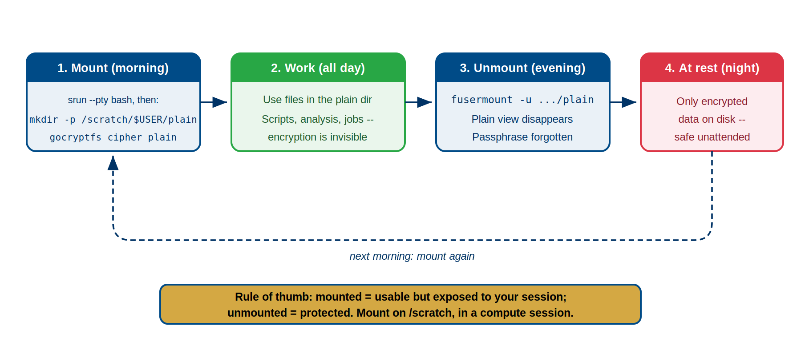
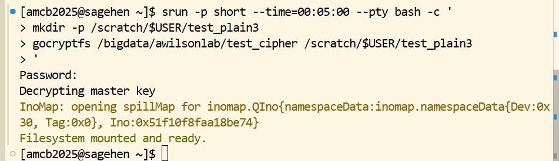

:::::::::::::::::::::::::::::::::::::: questions
- How do you mount and unmount gocryptfs directories?
- What is the daily workflow for encrypted data?
- Why must plain directories be empty before mounting?
- What are the security implications of mounted directories?
- How do you handle "device busy" errors?
::::::::::::::::::::::::::::::::::::::::::::::::

::::::::::::::::::::::::::::::::::::: objectives
- Build a daily workflow habit: mount at start, unmount at end
- Understand the anatomy of the mount command and each argument
- Verify mounts using three different verification methods
- Know security implications of who can access mounted data
- Handle "device busy" errors and stale mounts using lsof and fusermount
- Understand that mounts do NOT survive node reboots or job completion
::::::::::::::::::::::::::::::::::::::::::::::::

## Daily Workflow

::::::::::::::::::::::::::::::::::::::: callout

## Mount From a Compute Session, Onto /scratch

Two hard rules on Sagehen: the plain directory (mountpoint) must be on
node-local `/scratch/$USER/` — FUSE refuses to mount onto `/bigdata` (BeeGFS is
a network filesystem) — and mounting happens **inside a compute session**
(`srun --pty bash` for interactive work, or within an `sbatch` script), never
on the login node. Since `/scratch` is cleaned between jobs, start each session
with `mkdir -p /scratch/$USER/your_plain`.

:::::::::::::::::::::::::::::::::::::::::::::::

Mounting and unmounting is part of your daily work habit, not a one-time setup:

**Start of work session**: Log in → Mount directories → Work normally → Applications access files transparently

**End of work session**: Close applications → Unmount directories → Encrypted data becomes inaccessible

**Key principle**: Mounted = accessible but protected by FUSE permissions (700); Unmounted = physically encrypted on disk

::::::::::::::::::::::::::::::::::::: callout
{alt='Four-step daily cycle. Step 1, mount in the morning: start an interactive compute session with srun, create the mountpoint with mkdir -p /scratch/$USER/plain, then run gocryptfs. Step 2, work all day: use files in the plain directory; scripts, analysis, and jobs run with encryption invisible. Step 3, unmount in the evening: fusermount -u plain; the plain view disappears and the passphrase is forgotten. Step 4, at rest overnight: only encrypted data on disk, safe unattended. A dashed arrow loops back to mounting again the next morning. Banner: mounted equals usable but exposed to your session; unmounted equals protected; mount on /scratch inside a compute session.'}

## Security: Mounted vs. Unmounted

1. **At rest** (unmounted): Files encrypted on disk. Without the password, data is unreadable.
2. **In use** (mounted): Files decrypted in RAM/cache. Only you and root can access due to FUSE permissions (700).

Best practice: Unmount when away from your desk to protect against local disk access attacks.
::::::::::::::::::::::::::::::::::::::::::::::::

## Mount Command Anatomy

Basic syntax:
```bash
gocryptfs [cipher_directory] [plain_directory]
```

**cipher_directory**: Permanent encrypted storage with gocryptfs.conf and gocryptfs.diriv

**plain_directory**: Mount point where decrypted files appear (must be empty and owned by you)

Example:

```bash
$ gocryptfs /bigdata/lab/<labname>/project_cipher /scratch/$USER/project_plain
Password: [enter your password]
Filesystem mounted successfully.
```

{alt='Terminal on Sagehen. An srun command on the short partition opens a five-minute interactive session running a small script that first creates the mountpoint with mkdir -p under /scratch/$USER, then runs gocryptfs against a cipher directory on /bigdata. gocryptfs prompts for a password, reports that it is decrypting the master key, prints an InoMap spillMap line, and finishes with the message that the filesystem is mounted and ready. The shell prompt then returns.'}

Note the order: the `srun` session comes first, then `mkdir -p` on `/scratch`,
then the mount. Running `gocryptfs` before you have a compute session, or against
a mountpoint on `/bigdata`, is the most common way this fails.

## Permission Requirements

### Plain Directory Must Be Empty

FUSE requires the mount point to be empty. If not:
```bash
# Check and clean
ls -la /scratch/$USER/project_plain/
rm -rf /scratch/$USER/project_plain/*
rm -rf /scratch/$USER/project_plain/.* 2>/dev/null
```

### You Must Own the Plain Directory

```bash
# Check ownership
ls -ld /scratch/$USER/project_plain

# Fix if needed
chown username /scratch/$USER/project_plain
```

### Correct Directory Structure

```bash
/bigdata/lab/<labname>/
  └── project_cipher/          # encrypted data: persistent, backed up (BeeGFS)

/scratch/$USER/                # node-local, inside your compute session
  └── project_plain/           # empty mountpoint -- recreate each session
```

The plain directory must never be nested inside the cipher directory, and it
cannot live anywhere under `/bigdata`.

### Automatic Permissions After Mount

```bash
$ ls -ld /scratch/$USER/project_plain
drwx------ username groupname   # Only you can access
```

## Verifying Successful Mount

After mounting, use these methods:

::::::::::::::::::::::::::::::::::::: callout
## Verification Idiom: `mountpoint -q` for Scripts
For verification logic in scripts, prefer `mountpoint -q $MOUNT_POINT` (exact, no false positives). Use `mount | grep` only for interactive inspection.
::::::::::::::::::::::::::::::::::::::::::::::::

**Method 1 (script-safe): mountpoint -q**
```bash
if mountpoint -q /scratch/$USER/project_plain; then
    echo "Mounted"
fi
```

**Method 2 (human inspection): mount | grep gocryptfs**
```bash
gocryptfs on /scratch/$USER/project_plain type fuse.gocryptfs (...)
```

**Method 3: df /scratch/$USER/project_plain**
```bash
Filesystem        1K-blocks    Used Available Mounted on
gocryptfs         1048576000  51200 ...       /scratch/$USER/project_plain
```

**Method 4: ls -la /scratch/$USER/project_plain/**
Shows files with original names if mounted; empty if not.

## Security: Who Can Access Mounted Data

- **You (owner)**: Always can access
- **root**: Always can access (Linux superuser privilege)
- **Group/others**: Cannot access (directory has 700 permissions)

### The allow_other Option: Use with Caution

```bash
gocryptfs -o allow_other /bigdata/lab/<labname>/project_cipher /scratch/$USER/project_plain
```

**WARNING**: Only use for PUBLIC or PROPRIETARY data with explicit permission. Do NOT use for RESTRICTED data—it defeats security classifications and may violate FERPA/HIPAA.

## Unmounting

### Basic Unmount

```bash
$ fusermount -u /scratch/$USER/project_plain
```

What unmounting does:

1. Closes all file handles
2. Flushes caches to disk
3. Stops FUSE daemon
4. Plain directory becomes empty again
5. Files remain encrypted on disk

### When to Unmount

- Before leaving your desk
- Before logging out
- Before rebooting
- When not actively using encrypted files

### Handling "Device Busy" Errors

```bash
$ fusermount -u /scratch/$USER/project_plain
Error: device or resource busy
```

A process still has the directory open. Find and close it:

```bash
# Find open files
$ lsof /scratch/$USER/project_plain/
COMMAND    PID USER
python3    1234 username ...

# Kill the process
kill 1234
sleep 2

# Try unmount again
fusermount -u /scratch/$USER/project_plain
```

Last resort: lazy unmount (use only if processes won't respond)
```bash
fusermount -uz /scratch/$USER/project_plain
```

### Stale Mounts from Crashed Sessions

If gocryptfs crashes, you may see (human inspection — use `mountpoint -q` in scripts):
```bash
$ mount | grep gocryptfs
gocryptfs on /scratch/$USER/project_plain type fuse.gocryptfs [DEFUNCT]
```

Clean it up:
```bash
fusermount -uz /scratch/$USER/project_plain
# If still stuck, remove and recreate the directory
rmdir /scratch/$USER/project_plain
mkdir /scratch/$USER/project_plain
```

## Mount Persistence: Critical Facts

**Mounts do NOT survive reboots or job completion.**

### Why: Reboots

When a compute node reboots:
- All FUSE mounts disconnect
- All processes are killed
- You must remount manually

This is a security feature—it forces fresh password entry and prevents stale mounts.

### Why: Job Completion

SLURM jobs are isolated. When a job ends:
- All processes are killed
- FUSE mounts disconnect
- You must remount in the next job

For long jobs, keep mounts active throughout—only unmount at job end.

## Challenges

::::::::::::::::::::::::::::::::::::: challenge

## Challenge: Mount/Unmount Verification Drill

Build muscle memory for the daily workflow.

**Setup**: Create test directories
```bash
mkdir -p /bigdata/lab/<labname>/drill_cipher /scratch/$USER/drill_plain
gocryptfs -init /bigdata/lab/<labname>/drill_cipher
# Create password
```

**Exercise**:

1. **Mount and verify** using multiple methods: `mountpoint -q` (script-safe), `mount | grep` (human inspection), `df`, `ls`
2. **Create a test file**: `echo "Test 1" > /scratch/$USER/drill_plain/file1.txt`
3. **Check encrypted version**: `ls /bigdata/lab/<labname>/drill_cipher/` — should show encrypted filename
4. **Unmount and verify**: `fusermount -u`, then `ls` should show empty directory
5. **Remount and verify file persists**: File should still be there
6. **Test wrong password**: Try mounting with wrong password—should fail with "master key is corrupted"
7. **Clean up**: Unmount with correct password

**Success criteria**:
- Mount verified all three ways
- Files visible when mounted, hidden when unmounted
- Wrong password rejected
- Files persist across mount/unmount cycles
- You can mount/unmount without errors

:::::::::::::::::::::::::::::::::::: solution

**Expected outcomes**:

1. First mount successful, file created and visible
2. Encrypted filename appears in cipher directory
3. Unmount removes file from view; empty directory shown
4. Remount shows file still present with correct content
5. Wrong password triggers "master key is corrupted" error and mount fails
6. Correct password allows mount and file access

**Common issues**:
- "Plain directory not empty": Clean with `rm -rf *` and `rm -rf .*`
- "Permission denied": Check ownership with `ls -ld`, use `chown` to fix
- "Device busy" on unmount: Use `lsof` to find process, `kill` it, retry
- Files not visible when mounted: Verify with `ls -la`, permissions should be readable

:::::::::::::::::::::::::::::::::

::::::::::::::::::::::::::::::::::::

::::::::::::::::::::::::::::::::::::: keypoints
- Daily workflow: Mount at start, unmount at end—build this habit
- Plain directory must be empty, owned by you, and NOT inside cipher directory
- Verify mounts: `mountpoint -q` for scripts, `mount | grep gocryptfs` for human inspection, plus `df` and `ls`
- Mounted = accessible but protected by FUSE permissions; Unmounted = encrypted on disk
- Never use allow_other on RESTRICTED data
- Handle "device busy" with lsof to find processes, then kill and retry
- Mounts do NOT survive reboots or job completion—this is a security feature
- Always unmount before leaving your desk or logging out
- Lazy unmount (fusermount -uz) is last resort when processes won't close
- Work transparently in plain directories; encryption happens automatically
::::::::::::::::::::::::::::::::::::

<!-- highlight <labname>/<myusername> placeholders in code blocks; remove if the varnish theme handles this natively -->
<script>(function(){var CSS='.sh-placeholder{color:#c2410c;font-weight:700}[data-bs-theme="dark"] .sh-placeholder,html.dark .sh-placeholder{color:#fdba74}@media (prefers-color-scheme: dark){[data-bs-theme="auto"] .sh-placeholder{color:#fdba74}}';var RX=/<labname>|<myusername>/g;function firstMatch(el){var w=document.createTreeWalker(el,NodeFilter.SHOW_TEXT,null),nodes=[],full='';while(w.nextNode()){nodes.push({n:w.currentNode,s:full.length});full+=w.currentNode.nodeValue;}RX.lastIndex=0;var m;while((m=RX.exec(full))){var s=m.index,e=s+m[0].length,inSpan=false,parts=[];for(var j=0;j<nodes.length;j++){var ns=nodes[j].s,ne=ns+nodes[j].n.nodeValue.length;if(ne<=s||ns>=e)continue;parts.push({node:nodes[j].n,a:Math.max(s-ns,0),b:Math.min(e-ns,nodes[j].n.nodeValue.length)});var p=nodes[j].n.parentNode;while(p&&p!==el){if(p.classList&&p.classList.contains('sh-placeholder')){inSpan=true;break;}p=p.parentNode;}}if(!inSpan&&parts.length)return parts;}return null;}function wrapParts(parts){for(var i=parts.length-1;i>=0;i--){var t=parts[i].node,txt=t.nodeValue,a=parts[i].a,b=parts[i].b;var span=document.createElement('span');span.className='sh-placeholder';span.textContent=txt.slice(a,b);var f=document.createDocumentFragment();if(a>0)f.appendChild(document.createTextNode(txt.slice(0,a)));f.appendChild(span);if(b<txt.length)f.appendChild(document.createTextNode(txt.slice(b)));t.parentNode.replaceChild(f,t);}}function run(){var st=document.createElement('style');st.textContent=CSS;document.head.appendChild(st);document.querySelectorAll('pre,code').forEach(function(el){var guard=0,parts;while((parts=firstMatch(el))&&guard++<500){wrapParts(parts);}});}if(document.readyState==='loading'){document.addEventListener('DOMContentLoaded',run);}else{run();}})();</script>
