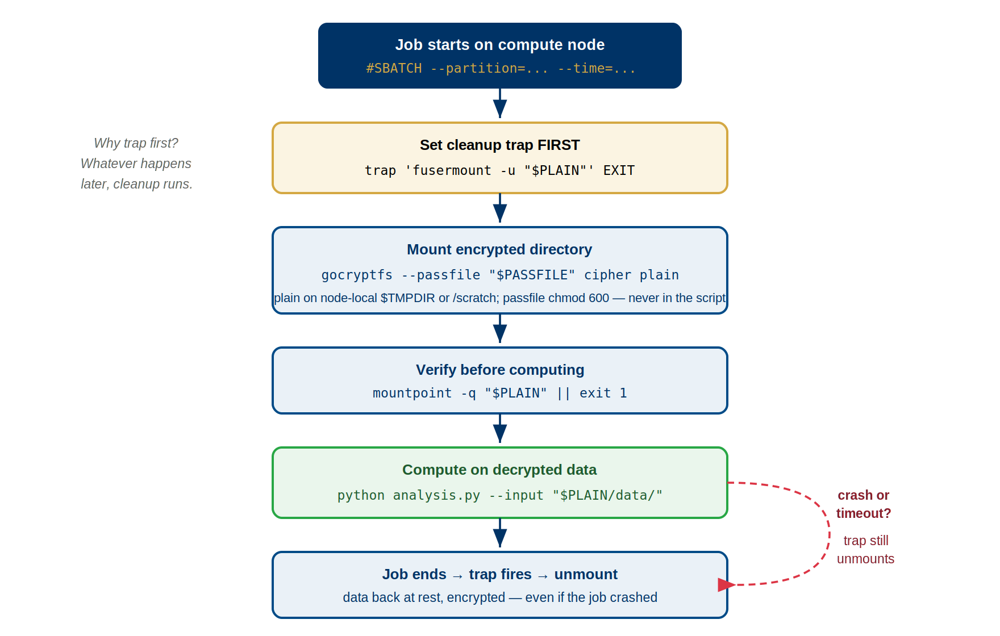

:::::::::::::::::::::::::::::::::::::: questions
- What does a production-ready SLURM script look like?
- How does the trap cleanup pattern work in detail?
- What storage location should you choose for mounted data?
- How do different storage locations compare in performance and persistence?
::::::::::::::::::::::::::::::::::::::::::::::::

::::::::::::::::::::::::::::::::::::: objectives
- Use complete annotated SLURM script templates
- Understand trap EXIT pattern for guaranteed cleanup
- Choose appropriate storage locations for mount points
- Implement proper error checking in SLURM scripts
- Build production-ready encrypted data workflows
::::::::::::::::::::::::::::::::::::::::::::::::

## SLURM Directives Reference

Key directives for encrypted data jobs:
- `#SBATCH --job-name=name` — Job identifier
- `#SBATCH --partition=gpu` — Queue (`amd`, `gpu`, or `short`)
- `#SBATCH --gres=gpu:1` — GPU request (adjust number)
- `#SBATCH --time=HH:MM:SS` — Max runtime
- `#SBATCH --mem=16G` — RAM needed per node
- `#SBATCH --cpus-per-task=4` — CPU cores per task
- `#SBATCH --output=%x_%j.log` — Log file naming

{alt='Flow diagram of the SLURM mount-compute-unmount pattern. The job starts on a compute node with SBATCH directives for partition and time. First, set a cleanup trap: trap fusermount -u dollar PLAIN on EXIT — whatever happens later, cleanup runs. Then mount the encrypted directory with gocryptfs --passfile, with the plain directory on node-local storage (TMPDIR or /scratch) and the passfile chmod 600, never embedded in the script. Verify with mountpoint -q dollar PLAIN or exit 1. Compute on the decrypted data, for example python analysis.py with input from the plain directory. When the job ends the trap fires and unmounts, leaving data at rest encrypted. A dashed red path shows that even on a crash or timeout the trap still unmounts.'}

## Production-Ready SLURM Script Template

```bash
#!/bin/bash
#SBATCH --job-name=encrypted_ml
#SBATCH --partition=gpu
#SBATCH --gres=gpu:1
#SBATCH --time=04:00:00
#SBATCH --mem=16G

# Setup
CIPHER=/bigdata/lab/<labname>/ml_data_cipher
PLAIN=$TMPDIR/ml_data_plain   # $TMPDIR is node-local (under /scratch) -- valid FUSE mountpoint
PASSWORD=$(cat ~/.gocryptfs_pw)
LOG_FILE="${SLURM_SUBMIT_DIR}/job_${SLURM_JOB_ID}.log"

# Cleanup function (runs on any exit)
cleanup() {
    local exit_code=$?
    echo "$(date): Cleanup starting (exit code: $exit_code)" >> "$LOG_FILE"
    fusermount -u -l "$PLAIN" 2>/dev/null
    rmdir "$PLAIN" 2>/dev/null
    exit $exit_code
}
trap cleanup EXIT

# Mount encrypted directory
mkdir -p "$PLAIN"
echo "$PASSWORD" | gocryptfs "$CIPHER" "$PLAIN" -
if [ $? -ne 0 ]; then
    echo "$(date): ERROR - Mount failed" >> "$LOG_FILE"
    exit 1
fi

# Verify data exists
if [ ! -f "$PLAIN/dataset/data.tar.gz" ]; then
    echo "$(date): ERROR - Data not found" >> "$LOG_FILE"
    exit 1
fi

# Load modules and run work
# Check `module avail` for the exact names/versions installed on Sagehen
module load miniconda3/py313_26.3.2-2
cd "$SLURM_SUBMIT_DIR"
python3 train_model.py --data "$PLAIN/dataset" --output results/

# Cleanup automatically on exit via trap
```

Key elements:
- **SLURM directives**: job name, partition, GPU, time, memory
- **Variables**: paths, password, log file for easy modification
- **Trap EXIT**: guarantees unmounting on success, error, or timeout
- **Error checking**: mount success and data verification
- **Logging**: timestamps for debugging
- **Cleanup on any exit**: prevents mounted data from persisting

## Trap Pattern for Reliable Cleanup

The `trap` command registers a function to run when your script exits:

```bash
trap cleanup EXIT
cleanup() {
    echo "Cleaning up..."
    fusermount -u -l "$PLAIN" 2>/dev/null
    rmdir "$PLAIN" 2>/dev/null
}
```

**EXIT signal catches**:
- Normal completion
- Job timeout (SLURM sends TERM → EXIT)
- Manual cancellation (scancel)
- Job crashes or errors
- Out-of-memory kills

**Why EXIT is essential**: Cleanup runs before job exits even if Python crashes, segfaults, or returns error. This guarantees unmounting, preventing mounted plaintext from persisting after job ends.

**Pattern for error handling**: Check exit codes instead of using `&&` chains. Trap ensures cleanup runs on any exit path:

```bash
python3 step1.py
if [ $? -ne 0 ]; then
    echo "Step 1 failed"
    exit 1
fi
python3 step2.py
# ... cleanup runs on exit regardless
```

## Common SLURM Script Patterns

**Pattern 1: Fast I/O with temporary /tmpfs mount**
```bash
#!/bin/bash
#SBATCH --job-name=fast_analysis
#SBATCH --time=01:00:00

CIPHER=/bigdata/lab/<labname>/data_cipher
PLAIN=$TMPDIR/data_plain
PASSWORD=$(cat ~/.gocryptfs_pw)

cleanup() {
    fusermount -u -l "$PLAIN" 2>/dev/null
    rmdir "$PLAIN" 2>/dev/null
}
trap cleanup EXIT

mkdir -p "$PLAIN"
echo "$PASSWORD" | gocryptfs "$CIPHER" "$PLAIN" -
if [ $? -ne 0 ]; then exit 1; fi

python3 analysis.py "$PLAIN/dataset.csv"
```

**Pattern 2: Persistent results (output to /bigdata)**
```bash
#!/bin/bash
CIPHER=/bigdata/lab/<labname>/inputs_cipher
PLAIN=$TMPDIR/inputs_plain
PASSWORD=$(cat ~/.gocryptfs_pw)

cleanup() {
    fusermount -u -l "$PLAIN" 2>/dev/null
}
trap cleanup EXIT

mkdir -p "$PLAIN"
echo "$PASSWORD" | gocryptfs "$CIPHER" "$PLAIN" -

# Process and save results to persistent /bigdata
python3 process.py "$PLAIN/data.csv" > /bigdata/lab/<labname>/results.txt

# Results remain after job ends
```

**Pattern 3: Multi-file processing with error checking**
```bash
#!/bin/bash
CIPHER=/bigdata/lab/<labname>/dataset_cipher
PLAIN=$TMPDIR/dataset_plain
PASSWORD=$(cat ~/.gocryptfs_pw)
LOG="/tmp/job_${SLURM_JOB_ID}.log"

cleanup() {
    echo "$(date): Cleanup starting" >> "$LOG"
    fusermount -u -l "$PLAIN" 2>/dev/null
    echo "$(date): Job complete" >> "$LOG"
}
trap cleanup EXIT

mkdir -p "$PLAIN"
echo "$PASSWORD" | gocryptfs "$CIPHER" "$PLAIN" -
[ $? -ne 0 ] && { echo "Mount failed"; exit 1; }

# Check required files exist before processing
[ -f "$PLAIN/input.csv" ] || { echo "Missing input.csv"; exit 1; }
[ -d "$PLAIN/models" ] || { echo "Missing models dir"; exit 1; }

# Log and process
echo "$(date): Starting processing" >> "$LOG"
for file in "$PLAIN"/data/*.txt; do
    python3 process.py "$file" >> "$LOG" 2>&1 || exit 1
done
echo "$(date): Processing complete" >> "$LOG"
```

This pattern includes logging, error checking, and modular structure for maintainability.

## Choosing Mount Locations

Choose your mount point based on performance, persistence, and quota needs:

| Location | Speed | Persistence | Quota | Use Case |
|----------|-------|-------------|-------|----------|
| **/tmpfs** | Fastest (RAM) | Ephemeral (deleted on job end) | None | I/O-bound work, temporary data, speed-critical jobs |
| **/scratch** | Medium (SSD) | Ephemeral (deleted on job end) | None | Large encrypted datasets, pre-processing |
| **/bigdata** | Slowest (network BeeGFS) | Persistent | Yes (counts against quota) | Multi-job pipelines, persistent outputs |

**Quick decision guidelines**:
- Small data (<10 GB), need speed → `/tmpfs` (mount to `$TMPDIR`)
- Large data (>10 GB), need speed → `/scratch` (mount to `/scratch/$USER/`)
- Need data persistence after job → `/bigdata` (stays on disk)
- Multi-step pipelines (job 1 output → job 2 input) → `/bigdata` (persistent)

**Performance comparison**: `/tmpfs` (8000 MB/sec) > `/scratch` (500 MB/sec) > `/bigdata` (400 MB/sec). Choose `/tmpfs` if data fits in node RAM, otherwise use `/scratch` for temporary speed, `/bigdata` for persistence.

## Best Practices

**Before running jobs**:
1. Create password file: `echo "mypassword" > ~/.gocryptfs_pw && chmod 600 ~/.gocryptfs_pw`
2. Store in encrypted /rhome, never in /bigdata or /scratch
3. Test password manually: `gocryptfs /cipher /mnt` (interactive test)
4. Test full script on small data first before production use
5. Verify you can decrypt with `gocryptfs /cipher /test_mount`

**In your script**:
1. Always set `trap cleanup EXIT` immediately after defining cleanup function
2. Verify mount succeeded before accessing data
3. Log important steps with timestamps
4. Check that expected data files exist before processing
5. Capture and return exit codes for job status tracking
6. Test mounted directory is readable: `ls /path > /dev/null || exit 1`

**Troubleshooting common issues**:
- Mount fails: Check password is correct, verify paths exist, ensure plain directory is empty
- Permission denied: Check ownership with `ls -ld /path`, ensure you own cipher directory
- Device busy on unmount: Use `lsof /path` to find processes, kill them, retry unmount with `fusermount -uz`
- "Transport endpoint not connected": Stale FUSE mount from crash. Use `fusermount -u -z /path` to force unmount, then remount

::::::::::::::::::::::::::::::::::::: challenge

## Challenge: Build a Complete Script

Write a SLURM script that does the following:

1. Requests 2 hours on the `amd` partition with 8 CPU cores and 32 GB of memory
2. Mounts the encrypted directory at `/bigdata/lab/<labname>/survey_cipher` to a plain directory at `$TMPDIR/survey_plain`
3. Reads the password from `~/.gocryptfs_pw`
4. Verifies the mount succeeded and that the file `responses.csv` exists
5. Runs `python3 analyze_survey.py $TMPDIR/survey_plain/responses.csv`
6. Uses a `trap` to guarantee cleanup on any exit

::::::::::::::::::::::::::::::::::::: solution

## Solution

```bash
#!/bin/bash
#SBATCH --job-name=survey_analysis
#SBATCH --partition=amd
#SBATCH --time=02:00:00
#SBATCH --cpus-per-task=8
#SBATCH --mem=32G

# Paths
CIPHER=/bigdata/lab/<labname>/survey_cipher
PLAIN=$TMPDIR/survey_plain
PASSWORD=$(cat ~/.gocryptfs_pw)

# Cleanup function — runs on ANY exit (success, error, timeout, cancel)
cleanup() {
    fusermount -u -l "$PLAIN" 2>/dev/null
    rmdir "$PLAIN" 2>/dev/null
}
trap cleanup EXIT

# Create mount point and mount
mkdir -p "$PLAIN"
echo "$PASSWORD" | gocryptfs "$CIPHER" "$PLAIN" -
if [ $? -ne 0 ]; then
    echo "ERROR: gocryptfs mount failed"
    exit 1
fi

# Verify expected data file exists
if [ ! -f "$PLAIN/responses.csv" ]; then
    echo "ERROR: responses.csv not found in encrypted directory"
    exit 1
fi

# Run analysis
module load miniconda3/py313_26.3.2-2
python3 analyze_survey.py "$PLAIN/responses.csv"

# Cleanup runs automatically via trap EXIT
```

Key elements: `trap cleanup EXIT` guarantees unmounting even if Python crashes or SLURM times out; the password is read from a chmod-600 file in `/rhome`; the mount point uses `$TMPDIR` for fastest I/O; exit codes propagate correctly for SLURM job tracking.

::::::::::::::::::::::::::::::::::::::::::::::

:::::::::::::::::::::::::::::::::::::::::::::::

::::::::::::::::::::::::::::::::::::: keypoints
- Use complete annotated templates as starting points for your scripts
- Trap EXIT pattern guarantees cleanup on all exit paths (success, error, timeout, cancellation)
- Choose storage based on your needs: /tmpfs for speed, /bigdata for persistence
- Always check mount success before proceeding with analysis
- Capture exit codes and return original exit codes for proper job status tracking
::::::::::::::::::::::::::::::::::::::::::::::::

<!-- highlight <labname>/<myusername> placeholders in code blocks; remove if the varnish theme handles this natively -->
<script>(function(){var CSS='.sh-placeholder{color:#c2410c;font-weight:700}[data-bs-theme="dark"] .sh-placeholder,html.dark .sh-placeholder{color:#fdba74}@media (prefers-color-scheme: dark){[data-bs-theme="auto"] .sh-placeholder{color:#fdba74}}';var RX=/<labname>|<myusername>/g;function firstMatch(el){var w=document.createTreeWalker(el,NodeFilter.SHOW_TEXT,null),nodes=[],full='';while(w.nextNode()){nodes.push({n:w.currentNode,s:full.length});full+=w.currentNode.nodeValue;}RX.lastIndex=0;var m;while((m=RX.exec(full))){var s=m.index,e=s+m[0].length,inSpan=false,parts=[];for(var j=0;j<nodes.length;j++){var ns=nodes[j].s,ne=ns+nodes[j].n.nodeValue.length;if(ne<=s||ns>=e)continue;parts.push({node:nodes[j].n,a:Math.max(s-ns,0),b:Math.min(e-ns,nodes[j].n.nodeValue.length)});var p=nodes[j].n.parentNode;while(p&&p!==el){if(p.classList&&p.classList.contains('sh-placeholder')){inSpan=true;break;}p=p.parentNode;}}if(!inSpan&&parts.length)return parts;}return null;}function wrapParts(parts){for(var i=parts.length-1;i>=0;i--){var t=parts[i].node,txt=t.nodeValue,a=parts[i].a,b=parts[i].b;var span=document.createElement('span');span.className='sh-placeholder';span.textContent=txt.slice(a,b);var f=document.createDocumentFragment();if(a>0)f.appendChild(document.createTextNode(txt.slice(0,a)));f.appendChild(span);if(b<txt.length)f.appendChild(document.createTextNode(txt.slice(b)));t.parentNode.replaceChild(f,t);}}function run(){var st=document.createElement('style');st.textContent=CSS;document.head.appendChild(st);document.querySelectorAll('pre,code').forEach(function(el){var guard=0,parts;while((parts=firstMatch(el))&&guard++<500){wrapParts(parts);}});}if(document.readyState==='loading'){document.addEventListener('DOMContentLoaded',run);}else{run();}})();</script>
