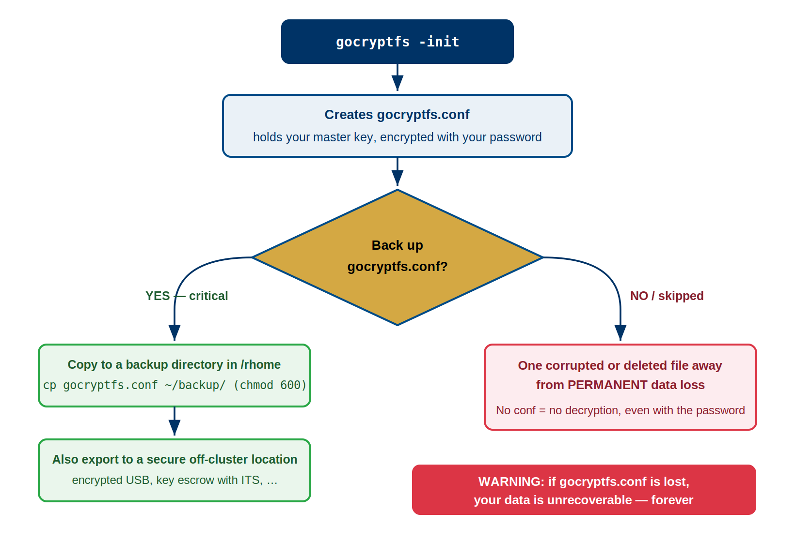
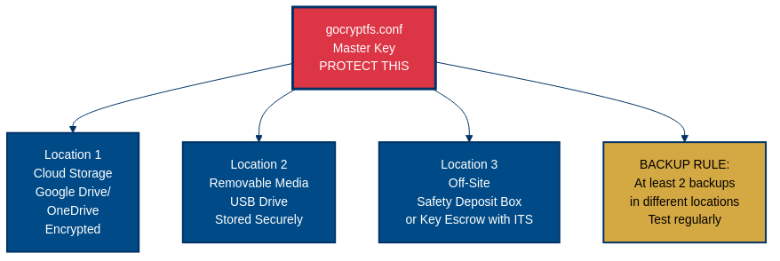

:::::::::::::::::::::::::::::::::::::: questions
- What are the two critical components you must never lose?
- What happens if you lose gocryptfs.conf?
- What does gocryptfs.conf contain and why does every field matter?
- How do you apply the 3-2-1 backup rule to encryption keys?
- Where should you store backups of gocryptfs.conf?
::::::::::::::::::::::::::::::::::::::::::::::::

::::::::::::::::::::::::::::::::::::: objectives
- Understand the critical difference between gocryptfs.conf and password
- Implement secure backup strategy for gocryptfs.conf
- Apply 3-2-1 backup rule to encryption keys
- Understand backup format and restoration procedures
- Compare backup storage locations for security and accessibility
::::::::::::::::::::::::::::::::::::::::::::::::

## The Two Things You Must Never Lose

Understand this clearly: **losing either one means permanent, irreversible data loss**. There is no backup plan, no recovery process, and no exceptions.

### Two Critical Components

```
Your encrypted data REQUIRES both:

1. gocryptfs.conf (the master key, encrypted)
   Location: [cipher_dir]/gocryptfs.conf
   Size: ~1 KB
   Contains: encrypted encryption key, salt, version info
   
2. Your Password (the decryption password)
   Location: your memory or secure password manager
   Contains: 14+ character passphrase
   
Data REQUIRES: gocryptfs.conf AND password
Without both: data is lost forever
```

### What Happens When You Lose One

| Component | Lost | Consequence |
|-----------|------|-------------|
| **gocryptfs.conf** + **Password present** | Lost conf, keep password | PERMANENT LOSS — no way to decrypt without conf |
| **gocryptfs.conf** + **Backup available** | Lost original, restore backup | FULL RECOVERY — restore conf, mount, access data |
| **Password** + **gocryptfs.conf present** | Forget password, have conf | PERMANENT LOSS — no password recovery exists |
| **Password** + **Can remember** | Temporary amnesia, remember later | FULL RECOVERY — conf still there, mount succeeds |
| **Both** | Lost both | ABSOLUTE PERMANENT LOSS — no recovery possible |

### Why Both Are Critical

**gocryptfs.conf contains:**
```json
{
  "Creator": "gocryptfs v2.4.0",
  "Version": 2,
  "EncryptionKey": "[256-bit key encrypted with your password]",
  "ScryptObject": {
    "N": 65536,
    "R": 8, 
    "P": 1,
    "Salt": "[32-byte random salt for key derivation]"
  }
}
```

The `EncryptionKey` field is your master encryption key. It's encrypted with your password using the scrypt key derivation function. **Without this file, the encrypted key is inaccessible. Without the encrypted key, no decryption is possible.** The password alone is useless.

**Your password is required because:**
- It decrypts the EncryptionKey field in gocryptfs.conf
- Without it, even with gocryptfs.conf, you cannot decrypt anything
- There is no "forgot password" recovery for gocryptfs
- AES-256-GCM encryption is cryptographically unbreakable

::::::::::::::::::::::::::::::::::::: callout
## Critical: Both Are Irreplaceable

This is cryptographic fact, not policy:

- **If you lose gocryptfs.conf**: Even NSA cannot help. You have no master key, encrypted or not. Data is lost.
- **If you forget your password**: Even NSA cannot help. Scrypt + AES-256 is mathematically unbreakable. Data is lost.
- **If you lose both**: This is the worst case. Absolutely no recovery possible.

This is not an exaggeration. This is how cryptography works.

Therefore: Treating these two things with extreme care is not optional.

::::::::::::::::::::::::::::::::::::::::::::::::

## Detailed gocryptfs.conf Anatomy

### What's Inside the Configuration File

Here's a real gocryptfs.conf with annotations:

```json
{
  "Creator": "gocryptfs v2.4.0",
  // Version of gocryptfs that created this configuration
  // Different versions may have compatibility implications
  
  "Version": 2,
  // Format version of this config file (increments when format changes)
  // Current standard is version 2 (since gocryptfs ~2.0)
  
  "EncryptionKey": "eW91LW...wI=",
  // THIS IS YOUR MASTER ENCRYPTION KEY (encrypted with your password)
  // Base64-encoded format
  // 256-bit key encrypted with AES-GCM
  // Useless without your password
  // Useless without scrypt parameters below
  // Size: ~88 bytes when encoded
  
  "ScryptObject": {
    "N": 65536,
    // Scrypt CPU cost parameter
    // Higher = slower password hashing = more resistant to brute force
    // N=65536 (2^16) is the standard for Sagehen/modern systems
    // Do NOT change this parameter
    
    "R": 8,
    // Scrypt block size parameter
    // Standard value for current gocryptfs
    // Do NOT change this parameter
    
    "P": 1,
    // Scrypt parallelization parameter
    // Low value (1) is standard
    // Do NOT change this parameter
    
    "Salt": "a1b2c3d4e5f6g7h8i9j0k1l2m3n4o5p6"
    // Random 32-byte salt (hex encoded)
    // Prevents rainbow table attacks
    // Unique per encrypted directory
    // Each password + salt combination produces different key
  }
}
```

### Why All Fields Matter

The complete gocryptfs.conf is essential because:

1. **EncryptionKey**: The actual encrypted master key. Losing this = losing the ability to decrypt.
2. **ScryptObject**: The parameters for deriving the encryption key from your password. Without these parameters, your password cannot unlock the EncryptionKey.
3. **Version**: Ensures compatibility between gocryptfs versions.

**You cannot recreate gocryptfs.conf.** There is no --recover option. There is no master password. If it's deleted, it's gone.

### Backup Format

When you back up gocryptfs.conf, preserve it exactly:

```bash
# Good - full backup
cp /bigdata/lab/<labname>/secret_cipher/gocryptfs.conf \
   ~/backup/gocryptfs_secret.conf.backup

# Not ideal - modified copy (might lose important data)
# Never edit, delete fields, or simplify the backup copy
```

{alt='Decision flow for key backup. Running gocryptfs -init creates gocryptfs.conf, which holds the master key encrypted with your password. At the decision point, back up gocryptfs.conf question mark. The YES branch, marked critical, copies the file to a backup directory in /rhome with chmod 600 and also exports it to a secure off-cluster location such as an encrypted USB drive or key escrow with ITS. The NO branch warns you are one corrupted or deleted file away from permanent data loss, because without the conf file there is no decryption even with the password. A warning banner states that if gocryptfs.conf is lost the data is unrecoverable forever.'}

## The 3-2-1 Backup Rule Applied to gocryptfs.conf

The 3-2-1 rule is a best practice for critical files: **3 copies, 2 different media types, 1 offsite location.**

### Application to gocryptfs.conf

```
Requirement: 3 copies of gocryptfs.conf

Copy 1: /rhome/<myusername>/backup/gocryptfs_secret.conf
  - Location: Sagehen HPC cluster, /rhome (regularly backed up)
  - Media: Network-attached storage (BeeGFS)
  - Access: Accessible from any Sagehen login
  - Loss scenario: Lost if Pomona HPC system destroyed
  
Copy 2: USB drive (physical offsite)
  - Location: Safe location (locked drawer, home safe)
  - Media: Physical USB storage (different media than BeeGFS)
  - Access: Must physically retrieve USB
  - Loss scenario: Lost only if USB physically destroyed/stolen
  
Copy 3: Password manager or encrypted email
  - Location: Cloud service (Bitwarden, 1Password, personal encrypted cloud)
  - Media: Cloud-hosted encrypted storage (different from both others)
  - Access: Accessible from anywhere with internet
  - Loss scenario: Lost only if cloud service and your password both compromised
```

### Backup Strategy Implementation

**Step 1: Create backup directory**
```bash
mkdir -p ~/backup/gocryptfs_keys
chmod 700 ~/backup/gocryptfs_keys
# chmod 700 = owner read/write/execute only, others have no access
```

**Step 2: Copy gocryptfs.conf to backup location**
```bash
# Assuming you have encrypted directory at:
# /bigdata/lab/<labname>/secret_cipher/ (with gocryptfs.conf inside)

# Copy to /rhome backup (Copy 1)
cp /bigdata/lab/<labname>/secret_cipher/gocryptfs.conf \
   ~/backup/gocryptfs_keys/gocryptfs_secret_2024_backup.conf

# Set permissions to 600 (owner read/write only)
chmod 600 ~/backup/gocryptfs_keys/gocryptfs_secret_2024_backup.conf
```

**Step 3: Create USB backup (Copy 2)**
```bash
# Insert USB drive and mount it
# (This depends on your system; ask HPC staff for USB mount procedure)

mount /mnt/usb  # Or wherever USB mounts on your system

# Copy to USB
cp ~/backup/gocryptfs_keys/gocryptfs_secret_2024_backup.conf /mnt/usb/

# Verify copy succeeded
ls -la /mnt/usb/gocryptfs_secret*

# Unmount safely
umount /mnt/usb

# Store USB in secure location (safe, locked drawer, home safe)
```

**Step 4: Cloud-based backup (Copy 3)**

Choose one of these approaches:

**Option A: Bitwarden (free, open-source password manager)**
```
1. Create free Bitwarden account (bitwarden.com)
2. Create secure note with filename "gocryptfs.conf - secret_cipher"
3. Create an attachment in that note
4. Upload the gocryptfs_secret_2024_backup.conf file as attachment
5. Store vault in secure note: remember Bitwarden master password
```

**Option B: Encrypted cloud storage (Google Drive, OneDrive, Dropbox)**
```bash
# Upload encrypted backup to cloud storage
# File is already encrypted (by gocryptfs.conf content itself)
# Cloud storage is encrypted in transit and at rest

# Option: encrypt before upload with gpg (advanced)
gpg --symmetric --cipher-algo AES256 \
    --output gocryptfs_secret_2024_backup.conf.gpg \
    ~/backup/gocryptfs_keys/gocryptfs_secret_2024_backup.conf
# Then upload .gpg file to cloud
# Requires remembering gpg passphrase to decrypt
```

**Option C: Encrypted email to yourself**
```bash
# Email the encrypted backup file to yourself
# Email is not encrypted, BUT the file contents are (encrypted by gocryptfs already)
# Useful as "long term archive" - can retrieve from email servers years later

To: your-email@pomona.edu
Subject: gocryptfs.conf backup - SECRET_CIPHER_DIRECTORY [DO NOT FORWARD]
Body: Automatic backup - see attachment
Attachment: gocryptfs_secret_2024_backup.conf
```

{alt='Diagram of gocryptfs.conf master key backup locations. The master key file, marked protect this, fans out to three locations: location 1 cloud storage such as Google Drive or OneDrive in encrypted form, location 2 removable media such as a USB drive stored securely, and location 3 off-site such as a safety deposit box or key escrow with ITS. A gold box states the backup rule: at least 2 backups in different locations, tested regularly.'}

## Backup Location Comparison Table

| Location | Pros | Cons | Risk Rating | Recommendation |
|----------|------|------|-------------|-----------------|
| **/rhome backup** | Convenient, accessible from cluster, integrated in Sagehen backups | Depends on single system (Pomona HPC), admin access possible | Medium | ✓ Primary backup |
| **USB drive** | Physical media, truly offsite, no internet dependency | Can be lost/stolen, requires manual storage, must remember where | Low (if stored safely) | ✓ Secondary backup |
| **Bitwarden cloud** | Accessible anywhere, encrypted, free, open-source | Depends on Bitwarden service, requires master password | Low-Medium | ✓ Tertiary backup |
| **1Password** | Professional password manager, accessible everywhere | Paid service, depends on cloud provider | Low-Medium | ✓ Tertiary backup |
| **Google/OneDrive** | Highly accessible, integrated with tools, encrypted in transit | Third-party company, potential data requests, encrypted but they hold keys | Medium | ✓ Acceptable backup |
| **Email to self** | Accessible from anywhere, permanent record | Unencrypted in transit (but file itself encrypted), stored on email servers, potential data requests | Medium | ✓ Last-resort backup |
| **Sticky note on monitor** | Free, instant access | COMPLETELY INSECURE — anyone can see it, theft risk | CRITICAL | ❌ NEVER DO THIS |
| **Written in notebook** | Simple, no technology | Must remember where, can be lost, legible handwriting is key recovery vulnerability | Medium | Use only if locked safe |

::::::::::::::::::::::::::::::::::::: challenge

## Challenge: Design Your Backup Strategy

You are a researcher working with HIPAA-regulated patient interview transcripts stored in an encrypted directory at `/bigdata/lab/neurolab/interviews_cipher/` on the Sagehen cluster. Design a complete 3-2-1 backup plan for your `gocryptfs.conf` and password. Your plan must address:

1. Where will each of your 3 copies of `gocryptfs.conf` be stored?
2. What 2 different media types will you use?
3. Which copy is your offsite (geographically separate) backup?
4. How will you store and protect the password?
5. How will you verify your backups still work?

::::::::::::::::::::::::::::::::::::: solution

## Solution

**Copy 1 — On-cluster (`/rhome`):**
```bash
cp /bigdata/lab/neurolab/interviews_cipher/gocryptfs.conf \
   /rhome/<myusername>/backup/gocryptfs_interviews.conf.backup
chmod 600 /rhome/<myusername>/backup/gocryptfs_interviews.conf.backup
```
Media type: Network-attached storage (BeeGFS). Accessible from any Sagehen login node.

**Copy 2 — USB drive (physical offsite):**
Copy `gocryptfs.conf` to an encrypted USB drive. Store the USB in a locked safe at home or in a campus lockbox. Media type: Physical removable media (different from network storage).

**Copy 3 — Encrypted cloud (Bitwarden):**
Upload `gocryptfs.conf` as a secure note attachment in Bitwarden. This is the offsite copy, accessible from anywhere with internet. Media type: Cloud-hosted encrypted storage.

**Password protection:**
Store the password in Bitwarden as a separate entry (not alongside the `gocryptfs.conf` attachment, so compromising one entry does not expose both). For HIPAA compliance, never transmit the password via email or messaging. The Bitwarden master password should be a unique 20+ character passphrase.

**Quarterly verification:**
```bash
# Copy backup to a test location and attempt to mount
mkdir -p /scratch/$USER/test_mount
cp /rhome/<myusername>/backup/gocryptfs_interviews.conf.backup /tmp/test_cipher/gocryptfs.conf
gocryptfs /tmp/test_cipher /scratch/$USER/test_mount
# Verify files are readable, then unmount and clean up
fusermount -u /scratch/$USER/test_mount
rm -rf /tmp/test_cipher /scratch/$USER/test_mount
```
Log the date of each successful test. HIPAA auditors may ask for evidence of backup verification.

::::::::::::::::::::::::::::::::::::::::::::::

:::::::::::::::::::::::::::::::::::::::::::::::

::::::::::::::::::::::::::::::::::::: keypoints
- Two critical components: gocryptfs.conf (the master key) and your password (the decryption key). Losing either = permanent data loss.
- gocryptfs.conf contains your encrypted master key and scrypt parameters; every field is essential and cannot be recreated.
- Implement 3-2-1 backup rule: 3 copies of gocryptfs.conf, 2 different media types (network storage + physical USB), 1 offsite location.
- Store backups in: /rhome (on-site), USB drive (physical offsite), and encrypted cloud (Bitwarden or 1Password).
- Test backup restoration regularly to verify your backup strategy actually works.
- Use chmod 600 for backup files to ensure only owner can read them.
- Never keep backups in insecure locations (sticky notes, unlocked drawers, email as text).
::::::::::::::::::::::::::::::::::::::::::::::::

<!-- highlight <labname>/<myusername> placeholders in code blocks; remove if the varnish theme handles this natively -->
<script>(function(){var CSS='.sh-placeholder{color:#c2410c;font-weight:700}[data-bs-theme="dark"] .sh-placeholder,html.dark .sh-placeholder{color:#fdba74}@media (prefers-color-scheme: dark){[data-bs-theme="auto"] .sh-placeholder{color:#fdba74}}';var RX=/<labname>|<myusername>/g;function firstMatch(el){var w=document.createTreeWalker(el,NodeFilter.SHOW_TEXT,null),nodes=[],full='';while(w.nextNode()){nodes.push({n:w.currentNode,s:full.length});full+=w.currentNode.nodeValue;}RX.lastIndex=0;var m;while((m=RX.exec(full))){var s=m.index,e=s+m[0].length,inSpan=false,parts=[];for(var j=0;j<nodes.length;j++){var ns=nodes[j].s,ne=ns+nodes[j].n.nodeValue.length;if(ne<=s||ns>=e)continue;parts.push({node:nodes[j].n,a:Math.max(s-ns,0),b:Math.min(e-ns,nodes[j].n.nodeValue.length)});var p=nodes[j].n.parentNode;while(p&&p!==el){if(p.classList&&p.classList.contains('sh-placeholder')){inSpan=true;break;}p=p.parentNode;}}if(!inSpan&&parts.length)return parts;}return null;}function wrapParts(parts){for(var i=parts.length-1;i>=0;i--){var t=parts[i].node,txt=t.nodeValue,a=parts[i].a,b=parts[i].b;var span=document.createElement('span');span.className='sh-placeholder';span.textContent=txt.slice(a,b);var f=document.createDocumentFragment();if(a>0)f.appendChild(document.createTextNode(txt.slice(0,a)));f.appendChild(span);if(b<txt.length)f.appendChild(document.createTextNode(txt.slice(b)));t.parentNode.replaceChild(f,t);}}function run(){var st=document.createElement('style');st.textContent=CSS;document.head.appendChild(st);document.querySelectorAll('pre,code').forEach(function(el){var guard=0,parts;while((parts=firstMatch(el))&&guard++<500){wrapParts(parts);}});}if(document.readyState==='loading'){document.addEventListener('DOMContentLoaded',run);}else{run();}})();</script>
