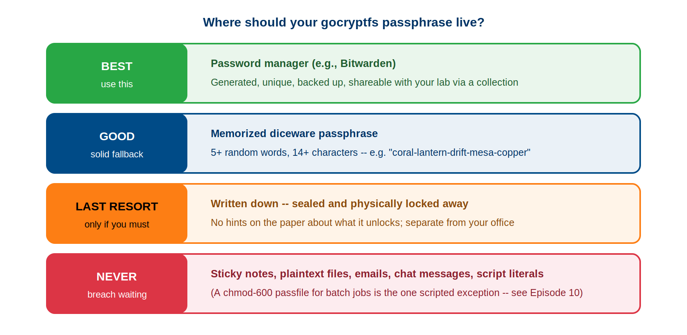

:::::::::::::::::::::::::::::::::::::: questions
- Why is memorizing multiple gocryptfs passwords unreliable?
- What password manager is recommended and why?
- How can you create a strong, memorable passphrase?
- When is it safe to write down passwords?
- How do you change a gocryptfs password, and what does re-encrypt mean?
::::::::::::::::::::::::::::::::::::::::::::::::

::::::::::::::::::::::::::::::::::::: objectives
- Understand why password managers are essential for managing encryption passwords
- Set up and use Bitwarden for secure password storage
- Create strong, memorable passphrases using the diceware method
- Know when and how to safely write down passwords
- Perform password changes without re-encrypting data
- Understand the difference between password changes and data re-encryption
::::::::::::::::::::::::::::::::::::::::::::::::

## Password Management Deep Dive

Your password is just as critical as gocryptfs.conf. Losing the password means losing all encrypted data, even with gocryptfs.conf in hand.

### Why Memorization Fails at Scale

If you have one encrypted directory, memorizing a password is reasonable. But as you work with research, you may have:

```
- Patient study A: password_studyA_secure
- Patient study B: password_studyB_secure
- Confidential lab records: password_labrecords_secure
- Collaboration with another lab: password_collab_secure
- Archive of old projects: password_archive_secure
```

**Trying to memorize multiple passwords:**
- Similar patterns create confusion (which password for which directory?)
- Memory degrades over time (perfect recall for years is unrealistic)
- Stress/illness can affect memory temporarily
- Long, secure passwords are harder to remember than simple ones
- Under pressure (urgent access needed), you may mistype password

**The solution**: Password manager.

### Password Manager Recommendation: Bitwarden

**Bitwarden is the recommended choice because:**
- Free tier is fully functional (no paid subscription required)
- Open-source and audited (transparent security)
- Available on all platforms (browser, phone, desktop, command-line)
- Encrypted end-to-end (Bitwarden cannot read your passwords)
- Can store attachments (attach gocryptfs.conf as redundant backup)
- Can organize by folder (e.g., "Research Encryption Keys")
- Can generate strong passwords

**Setup (15 minutes):**
```
1. Go to bitwarden.com, sign up for free account
2. Create master password (write this down once, store safely)
3. Save in browser extension (or phone app)
4. Create "gocryptfs passwords" folder
5. Add entries for each encrypted directory:
   - Name: "gocryptfs - study_a_cipher"
   - Username: [your username]
   - Password: [your gocryptfs password]
   - Notes: "Cipher: /bigdata/lab/<labname>/study_a_cipher"
```

**Using passwords from Bitwarden in job scripts:**
```bash
# Copy password from Bitwarden
# Paste into ~/.gocryptfs_pw file
# chmod 600 ~/.gocryptfs_pw
# Reference file in job scripts

PASSWORD=$(cat ~/.gocryptfs_pw)
echo "$PASSWORD" | gocryptfs "$CIPHER" "$PLAIN" -
```

{alt='Ranked ladder titled where should your gocryptfs passphrase live. BEST, green: a password manager such as Bitwarden — generated, unique, backed up, shareable with your lab via a collection. GOOD, blue: a memorized diceware passphrase of five or more random words and at least 14 characters, for example coral-lantern-drift-mesa-copper. LAST RESORT, orange: written down, sealed, and physically locked away, with no hints about what it unlocks, kept separate from your office. NEVER, red: sticky notes, plaintext files, emails, chat messages, or script literals — a chmod 600 passfile for batch jobs is the one scripted exception, covered in Episode 10.'}

## Passphrase Technique for Strong But Memorable Passwords

If you prefer not to use a password manager, you can create memorable yet secure passphrases:

### Diceware Method

**Diceware method** (true randomness):
```
Roll dice, get numbers, convert to words
1. Roll 5 dice → get 5 numbers → look up in diceware word list
2. Combine words: "correct horse battery staple correct"
3. Result: ~66 bits entropy, memorable, secure

Example password: 
  "Sagehen-Patient-Study-Delta-Encryption-2024-Pomona"
  (52 characters, multiple types, memorable context)

Length: Aim for 14+ characters minimum (NIST SP 800-63B)
        20+ characters is ideal for long-term encryption keys
```

### Bad Example (Do NOT Use)

```
"password123" - too simple, brute-forceable in minutes
"patient123" - predictable based on context
"MyPassword2024" - pattern + year is guessable
"Sagehen2024!" - contains system name + year, guessable
```

### Good Example

```
"Sagehen-StudyA-Enc-2024-Xtreme-Secure-Backup"
- Contains system name (reference for you)
- Contains study identifier (purpose)
- Length: 46 characters
- Mix of uppercase, lowercase, hyphens, numbers
- Not based on dictionary words (resistant to dictionary attacks)
- Memorable through context and repetition
```

## Writing Down Passwords (Only If Absolutely Necessary)

Sometimes memory fails and password managers aren't available. If you MUST write down a password:

### DO

```bash
# Write in sealed envelope
# Store in locked drawer or home safe
# Write password only, no context (don't write "Sagehen password" - too revealing)
# Destroy after confirming password manager has it
# Use on first login to password manager, then delete written copy

Example: Write only the password string, nothing else
  "Sagehen-StudyA-Enc-2024-Xtreme-Secure-Backup"
```

### DO NOT

```bash
# Never on sticky note on monitor (visible to anyone passing by)
# Never on piece of paper in desk drawer (easy to find)
# Never in email or messages (permanent digital record)
# Never in password in plain text file (files can be copied)
# Never combining multiple passwords in one place ("Passwords: study1=X, study2=Y")
# Never with context clues ("Sagehen Patient Study A password: Xxx123")
```

### What To Do If You MUST Write It Down

1. Use sealed envelope or physical safe
2. Write location of envelope in your will/emergency contacts (for succession)
3. Destroy paper copy once password manager is set up
4. Test password manager recovery before destroying paper copy

## Changing Passwords: gocryptfs -passwd

As part of security best practices, you should change passwords periodically (annually is reasonable).

### Understanding -passwd Command

```bash
# Change password for encrypted directory
gocryptfs -passwd /bigdata/lab/<labname>/secret_cipher/

# Prompted for:
# 1. Current password (to unlock gocryptfs.conf and verify access)
# 2. New password (what you want to change to)
# 3. Repeat new password (confirm new password)

# What changes: Only gocryptfs.conf (master key is re-encrypted)
# What does NOT change: Files remain unchanged (not re-encrypted)
```

### When to Change Passwords

**Annual rotation:**
```bash
# First working day of year
gocryptfs -passwd /bigdata/lab/<labname>/study_a_cipher/
gocryptfs -passwd /bigdata/lab/<labname>/study_b_cipher/
gocryptfs -passwd /bigdata/lab/<labname>/confidential_cipher/
```

**Suspected compromise:**
```bash
# If someone may have learned your password
# If USB backup with password was accessed
# If password manager account was compromised
# If you wrote password down and it could be found

# Change immediately (don't wait for annual rotation)
gocryptfs -passwd /bigdata/lab/<labname>/secret_cipher/
```

**Personnel change:**
```bash
# If research assistant who knew password leaves
# Change password so departed person cannot access
# They should help transfer their encrypted data before departure
```

### Re-encrypt vs Password Change

**Important: -passwd does NOT re-encrypt files**

```bash
# Before: master key encrypted with password_old
# After: master key encrypted with password_new
# Files: still encrypted with same master key (no re-encryption)

# This is efficient (doesn't require re-encrypting entire dataset)
# But means: old password can no longer access data (good for security)
```

**Scenario: Someone knew your old password but you changed it**
```
# Old password: no longer works (cannot decrypt new gocryptfs.conf)
# New master key is inaccessible to anyone with old password only
# Old password cannot be used to decrypt data anymore
# Files remain encrypted with same key (still protected)
```

::::::::::::::::::::::::::::::::::::: challenge

## Challenge: Generate a Strong Passphrase

Follow these steps to create a diceware-style passphrase and evaluate its strength:

1. Pick 6 random common English words (imagine rolling dice and looking them up in a word list). Write them down separated by hyphens.
2. Calculate the entropy of your passphrase. The standard diceware word list contains 7,776 words (6^5). Each word adds log2(7776) = ~12.9 bits of entropy.
3. How many bits of entropy does your 6-word passphrase have?
4. NIST SP 800-63B recommends a minimum of 14 characters. Does your passphrase meet this requirement?
5. Would you consider this passphrase strong enough for a gocryptfs directory containing HIPAA-protected data? Why or why not?

::::::::::::::::::::::::::::::::::::: solution

## Solution

**Example 6-word diceware passphrase:**
```
glacier-trumpet-anvil-sparrow-cobalt-furnace
```

**Entropy calculation:**
- Each word is chosen from 7,776 possibilities
- Entropy per word: log2(7776) = 12.9 bits
- Total entropy for 6 words: 6 x 12.9 = **77.4 bits**

**Length check:**
- "glacier-trumpet-anvil-sparrow-cobalt-furnace" = 46 characters (well above the 14-character minimum)

**Strength assessment:**
Yes, 77.4 bits of entropy is strong enough for HIPAA-protected data. At 1 trillion guesses per second (far beyond current capability against scrypt-protected keys), brute-forcing 77.4 bits would take approximately 2^77.4 / 10^12 seconds = ~4.8 million years. Combined with gocryptfs's scrypt key derivation (which deliberately slows each guess), this passphrase is practically unbreakable.

For maximum security, you could add a 7th word (90.3 bits) or mix in a number or symbol between words, but 6 words already exceeds the practical threat level for research data encryption.

::::::::::::::::::::::::::::::::::::::::::::::

:::::::::::::::::::::::::::::::::::::::::::::::

::::::::::::::::::::::::::::::::::::: keypoints
- Never rely on memorization alone for multiple gocryptfs passwords; use a password manager.
- Bitwarden is the recommended choice: free, open-source, encrypted end-to-end, available on all platforms.
- Create strong passwords using the diceware method or password manager generation (14+ characters minimum).
- Only write down passwords in sealed envelopes stored in locked safes, and destroy the written copy after setting up password manager.
- Never share passwords via email, text, or messaging; use in-person conversation or encrypted channels only.
- gocryptfs -passwd changes only the password, not the master key; files are not re-encrypted.
- After changing a password, update backups of gocryptfs.conf and test that the new password works.
- Change passwords annually or immediately if you suspect compromise or personnel changes.
::::::::::::::::::::::::::::::::::::::::::::::::

<!-- highlight <labname>/<myusername> placeholders in code blocks; remove if the varnish theme handles this natively -->
<script>(function(){var CSS='.sh-placeholder{color:#c2410c;font-weight:700}[data-bs-theme="dark"] .sh-placeholder,html.dark .sh-placeholder{color:#fdba74}@media (prefers-color-scheme: dark){[data-bs-theme="auto"] .sh-placeholder{color:#fdba74}}';var RX=/<labname>|<myusername>/g;function firstMatch(el){var w=document.createTreeWalker(el,NodeFilter.SHOW_TEXT,null),nodes=[],full='';while(w.nextNode()){nodes.push({n:w.currentNode,s:full.length});full+=w.currentNode.nodeValue;}RX.lastIndex=0;var m;while((m=RX.exec(full))){var s=m.index,e=s+m[0].length,inSpan=false,parts=[];for(var j=0;j<nodes.length;j++){var ns=nodes[j].s,ne=ns+nodes[j].n.nodeValue.length;if(ne<=s||ns>=e)continue;parts.push({node:nodes[j].n,a:Math.max(s-ns,0),b:Math.min(e-ns,nodes[j].n.nodeValue.length)});var p=nodes[j].n.parentNode;while(p&&p!==el){if(p.classList&&p.classList.contains('sh-placeholder')){inSpan=true;break;}p=p.parentNode;}}if(!inSpan&&parts.length)return parts;}return null;}function wrapParts(parts){for(var i=parts.length-1;i>=0;i--){var t=parts[i].node,txt=t.nodeValue,a=parts[i].a,b=parts[i].b;var span=document.createElement('span');span.className='sh-placeholder';span.textContent=txt.slice(a,b);var f=document.createDocumentFragment();if(a>0)f.appendChild(document.createTextNode(txt.slice(0,a)));f.appendChild(span);if(b<txt.length)f.appendChild(document.createTextNode(txt.slice(b)));t.parentNode.replaceChild(f,t);}}function run(){var st=document.createElement('style');st.textContent=CSS;document.head.appendChild(st);document.querySelectorAll('pre,code').forEach(function(el){var guard=0,parts;while((parts=firstMatch(el))&&guard++<500){wrapParts(parts);}});}if(document.readyState==='loading'){document.addEventListener('DOMContentLoaded',run);}else{run();}})();</script>
